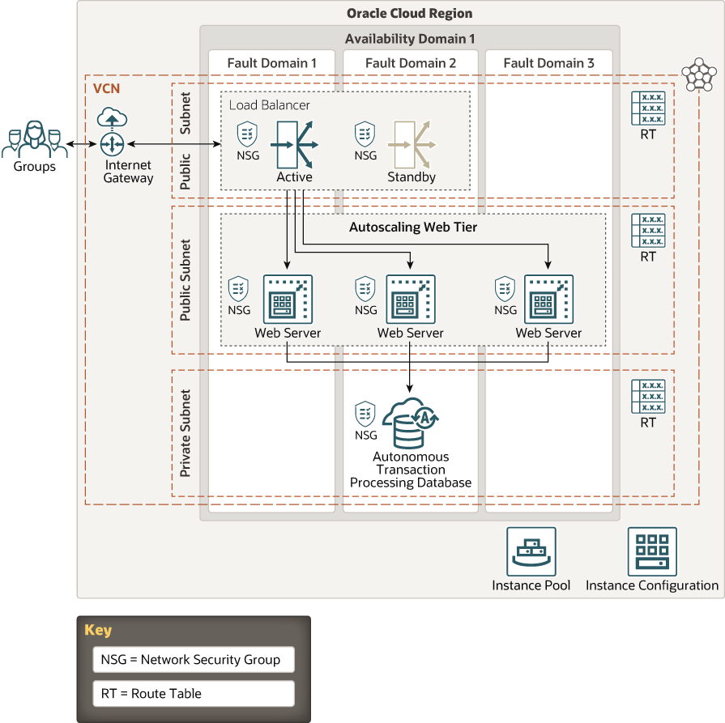

# Rideboard-arch

This is a Terraform module that deploys infrastruce of Rideboard using Container Engine for Kubernetes (OKE) on Oracle Cloud Infrastructure (OCI).

## About

Oracle Cloud Infrastructure Container Engine for Kubernetes is a fully-managed, scalable, and highly available service that you can use to deploy your containerized applications to the cloud. Use Container Engine for Kubernetes (sometimes abbreviated to just OKE) when your development team wants to reliably build, deploy, and manage cloud-native applications.

## Prerequisites

- Permission to `manage` the following types of resources in your Oracle Cloud Infrastructure tenancy: `vcns`, `internet-gateways`, `route-tables`, `network-security-groups`, `subnets`, `autonomous-database-family`, and `instances`.

- Quota to create the following resources: 1 VCN, 2 subnets, 1 Internet Gateway, 1 NAT Gateway, 2 route rules, 1 LoadBalancer, 1 ATP database instance (+ optional standby), and 3 compute instances (plus max 2 more as a result of autoscaling).

If you don't have the required permissions and quota, contact your tenancy administrator. See [Policy Reference](https://docs.cloud.oracle.com/en-us/iaas/Content/Identity/Reference/policyreference.htm), [Service Limits](https://docs.cloud.oracle.com/en-us/iaas/Content/General/Concepts/servicelimits.htm), [Compartment Quotas](https://docs.cloud.oracle.com/iaas/Content/General/Concepts/resourcequotas.htm).

## Architecture Diagram



## Terminating SSL/TLS at the Load Balancer (HTTPS)

Please use the following command creates a self-signed certificate, tls.crt, with its corresponding key, tls.key:
```
openssl req -x509 -nodes -days 365 -newkey rsa:2048 -keyout tls.key -out tls.crt -subj "/CN=rideboard/O=rideboard"
```
Use the following command to create a TLS secret in Kubernetes, whose key and certificate values are set by --key and --cert, respectively.
```
kubectl create secret tls ssl-certificate-secret --key tls.key --cert tls.crt
```
## Deploy ingress-nginx
kubectl apply -f https://raw.githubusercontent.com/kubernetes/ingress-nginx/controller-v1.1.2/deploy/static/provider/cloud/deploy.yaml

See [Defining Kubernetes Services of Type LoadBalancer](https://docs.oracle.com/en-us/iaas/Content/ContEng/Tasks/contengcreatingloadbalancer.htm)